# Git dan Github Lanjutan  

  

Semiasal kerjaan mereka ingin digabungkan sehingga akan ada 2 file.   

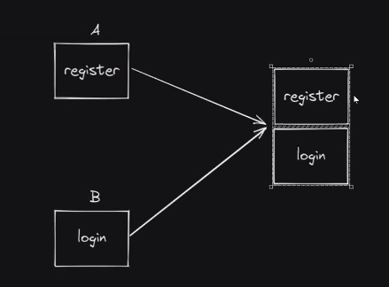  

Butuh kolaborasi karena  web code nya banyak, sehingga harus melakukan kolaborasi  
Fitur2 dibagi ke anggota team, trus disatuan  

 

Caranya buar reposito terlebih dahulu.  
Reposito dikasih akses ke anggota team, sehingga yg bisa dipush ke repo siapa aja gtu.  

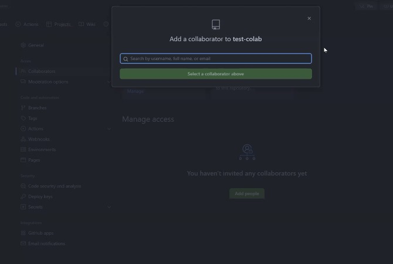   

>di invite    

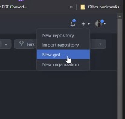  

>pilih new organization  

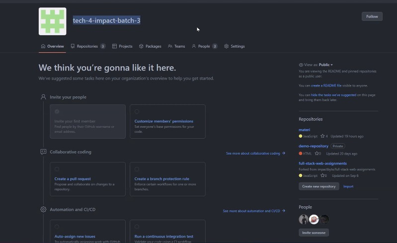  

>contoh hasilnya  

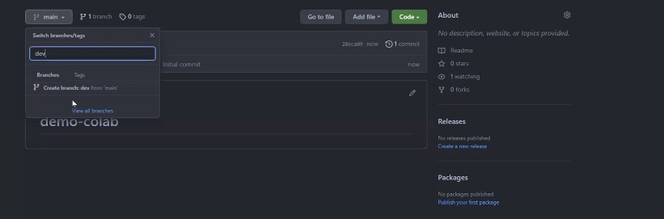   

>kalau uda buat akun, buat gini  

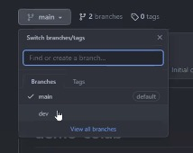  

>nnti pas kumpul tugas, dev dipindahin ke main  

 

Cara melakukan kolborasi di Github  

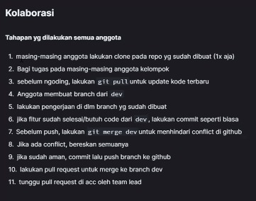  

 

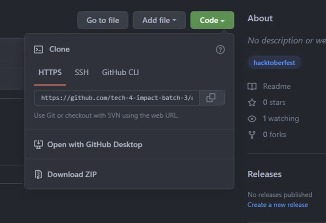  

>cara ngeclone, copy  

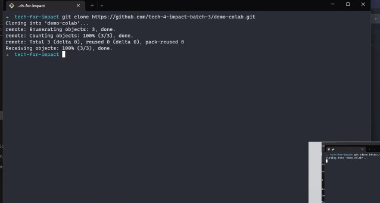  

>Di git bash buat gini  

Trus buka vs code  
Git clone, download repo ke device kita  

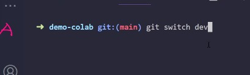  

>berpindah brench  
>brench berpindah jalur/track  

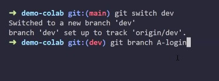  

>contoh si A buat fitur login  

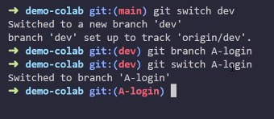  

>trus pindah ke login  

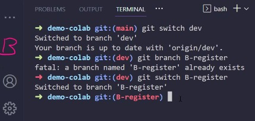  

>Yang B nya juga diulang  

 

Dev berguna sebagai cabang utama  
Yg dimana gunanya utk menampung cabang2 yang lain, terkumpul di dev. Jadi selama proses develop dia menampung segala macam cabang  
Dev sebagai branch kedua, main sbg branch utama, yg menjadi branch paling atas.  
Ketika tahap production ketika fitur go on public/semua org bisa akses  
Tahap development : tahap pengembangan, yg bisa akses hanya org internal  

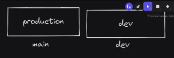  

Kalau cuman ada 1 branch, setiap percobaan masuk ke main.  
Dev itu proses yg masih kasar.  

 

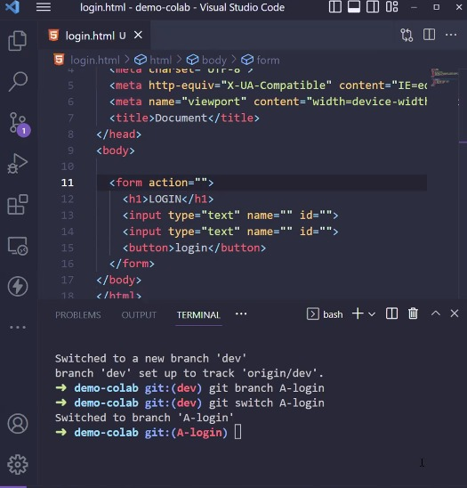  

>semisal code A uda siap  

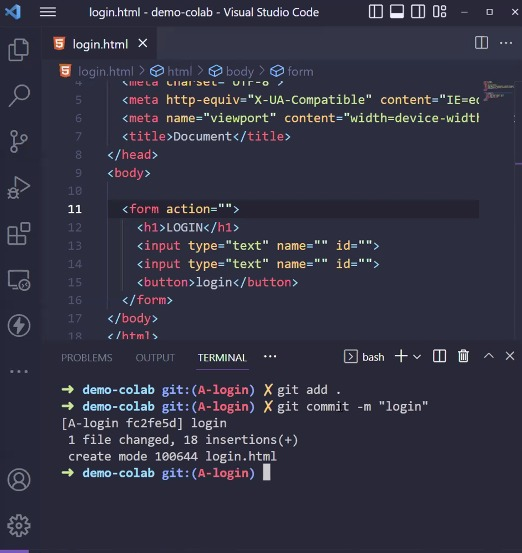  

>kemudian git add, commmit  

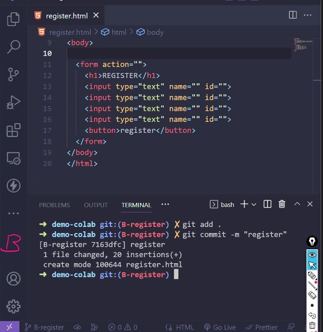  

>yang b nya juga  

kemudia si A mau ngepush   

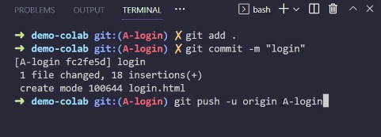  

>selesai origin nama brance nya  
>setelah push, melakukan pull request  

Balik lagi ke github  

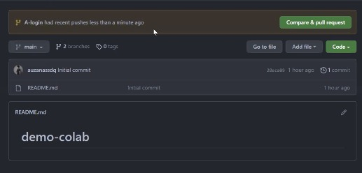  

>dari sini mengajukan, mengajukan permintaan menggabungkan branch  

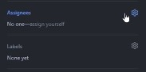  

>anggota harus ngasih assign  

Kalau sama git clone, gk perlu git remote  

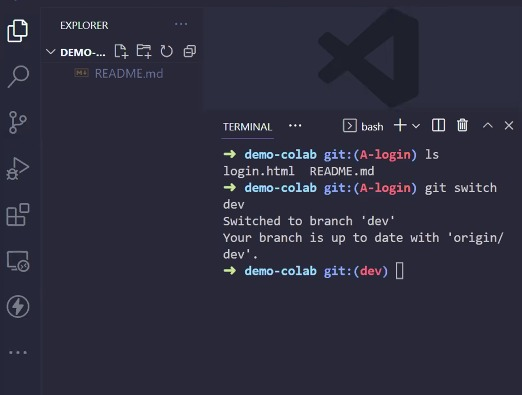  

>di dalam file laptop dev blm ada , adanya cuman di git hub  
>cara update, melakukan git pull  

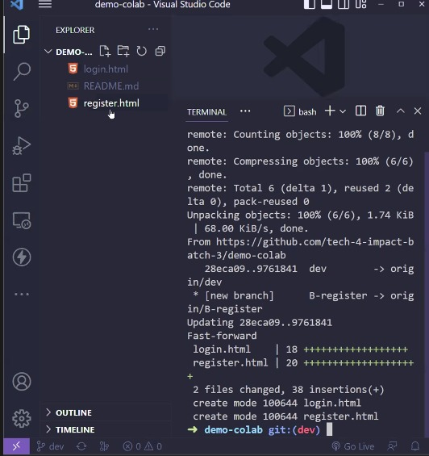   

>sehingga di branch dev ada  

Jika ingin menggabungkan  

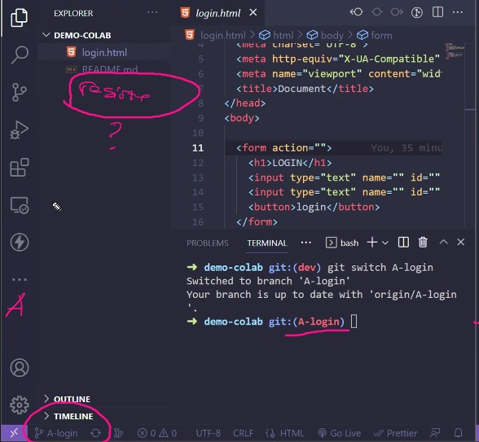   

>perlu ngambil dr dev  

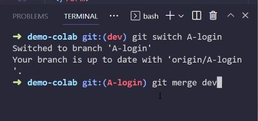  

>dia nyuruh menggabungkan branch dev ke branch dia  

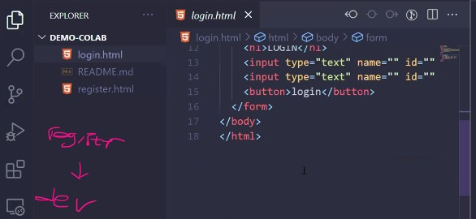  

>sehingga dapat  

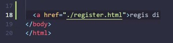  

>digabungkan dengan a href  
>kemudia git add lagi dan commit  
>kemudian dia git push  

 

Ketika menggabungkan ada conflict antar branch 1 ke yg lain liat file change untuk memerika confict.  
Konflik terjadi ketika lbh dr 1 org, ngotak ngatik di file yang sama.  

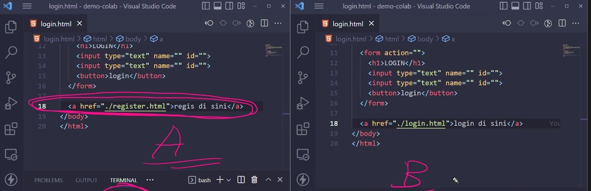  

>mereka mengotak-atik file yg sama  

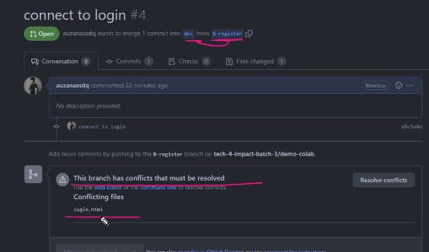   

>terjadi konflik  
>pilih yang mana hendak diperbaiki  
>kemudian git add dan push