# Responsive  Web Design  
Responsive Web Design (RWD) adalah bertujuan membuat desain website kita dapat diakses dalam deice apapun.  

 

#### Viewport  
Viewport adalah area web yg dpt diakses oleh user.   
view port bisa disetting dengan sebuah meta yang ada di html.  

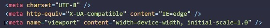   

Teknik selanjutnya adalah buat gbr jd responsive  

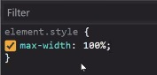  

>setting max width : ukuran mu 100% dr ukuran layar  

ketika layar dikecilin, gbr menyesuaikan dgn ukuran gambar  

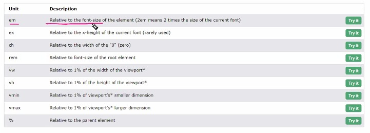  

>syntax yg lain  

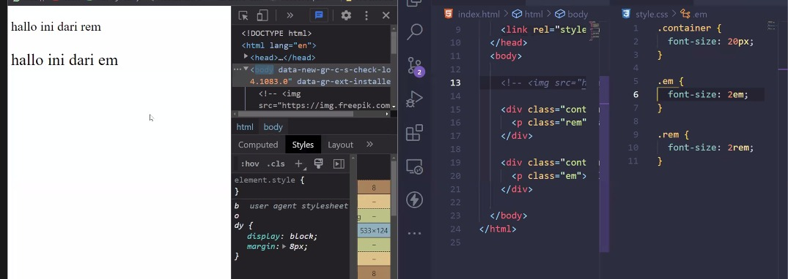   

>contoh, rem lebih besar  

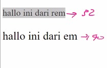   

>Berbeda  

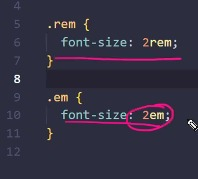   

>Padahal sma aukurannya 2  

Kenapa beda karena rem bergantung pada font size root nya  
default html font size adalah 16px  
klau set 2 rem berarti dikali 2, 16 x 2 makanya 32 px  
kalau em font size yg terdekat  

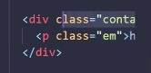   

>em ada di container, container 20px, parent nya adalah 20 px, maka 2 x 20 makanya 40 px  

kebanyakan ukuran root font size adalah 16 px  
maka ketika mengaktifkan rem maka akan nyaru ukuran font size dr root nya, semisal rootnya adalah html  
kalau em, mencari ukuran font size tp yg terdekat, semisal dr parent nya  

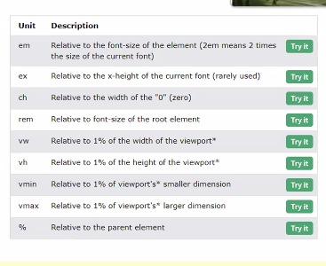   

>ukuran yang lainnya  

kalau vh langsung nembak ukuran layar  
vw akan mengikuti dr ukuran view port nya  
rem dan em kadang dipake untuk padding dan margin  
% cuman mnegikuti div
vw nembah ukuran view port nya  
vh tinggi layar  
vw lebar layar  
max width buat gambar  

 

Jenis-jenis responsive
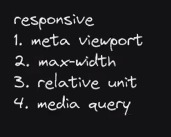   

**Media Querry**  
DIgunakan untuk membuat beberapa styles tergantung pada jenis device  

Contoh :  

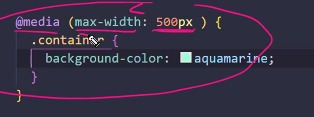  

>kalau layar di bawah 500 px maka yg dipake set di bawah  

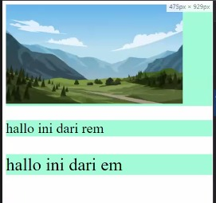   

>ketika di bawah 500 warnya berubah  

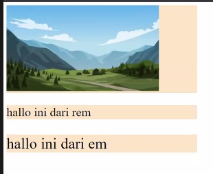    

>padahal awalnya pink  

 

**Bootstrap**  
Dapat membuat web lbh cepat, responsive  
Selain itu ada material UI  
Yang berhubungan dengan style, dia berhubungan dengan layout  

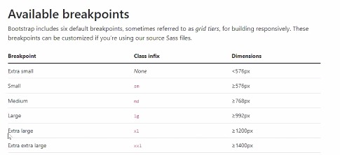  

>breakpoint boostrap  

Containers : layout basic boos mmebutuhkan kalau ingin menggunakan sistem grid  

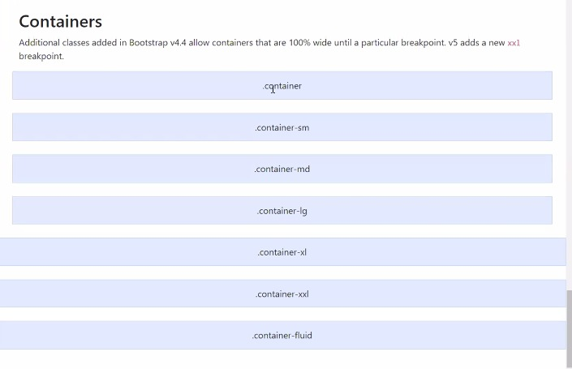  

>akan menyesuiakan ukurannya  

Menggunakan container untuk mengaur lay dan posisi dr konten  
Dibuat menggunakan flex box