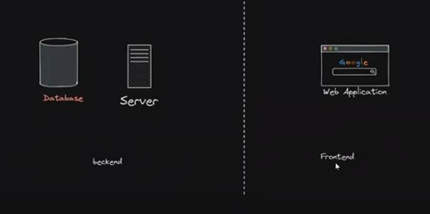
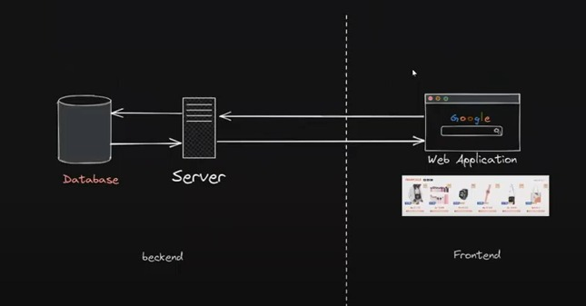
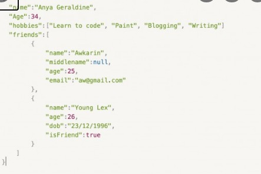
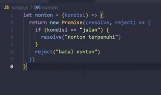
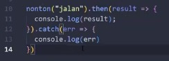
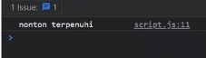
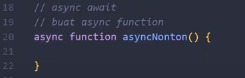
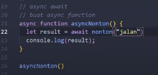
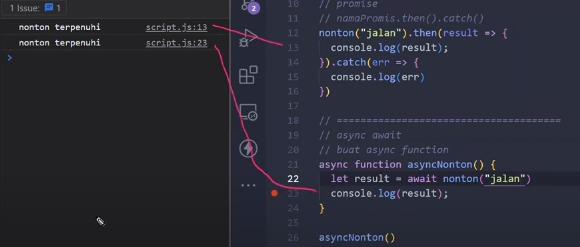
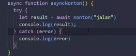

# Asynchronous  
Front-end adalah tempat buat websitenya, menampilkan datanya.  
Sedangakan di server adlaah bagian terpisah.  
Semua data-data ada di database.  
Ketika buka web si web akan minta data ke server. Nanti server akan mengambil data ke data base.  
Setelah itu dr data base akan memberikan ke server, dr server ke web, sehingga product2 akan tampil.  

  

>perbedaan front-end dan back-end  

  

>Akan ditampilakn product setelah data diambil dari database  

Perantara dari back-end ke front-end adalah API.  
Data yang bisa dipakai di API dalam bentuk JSON.   
JSON adalah JavaScript Object Notation.  
Bentuk dia mirip object tetapi tiapproperti ada kutip.   

  

 

Kebanyakan proses web yg dinamis menggunakan API untuk mengambil data ke server.
Satu server bisa diakses banyak device, karena sifatnya  
Selain API ada ada tempat penyimpanana yang lain utk gambar.  
Di Database data yang disimpan adalah bentuk string, number , teks, data tersturktur  
Audio, vidio menrupakan data tdk tersturktur disimpan di tempat lain, database kemudian menyimpan alamatnya.  
API akan ditangkap menggunakan promises.  

 

  

>Contoh promises  

Untuk menjalankan kode promises ada 2 cara :  

* **Promise then catch**  

  

>nama promisesnya apa. kemudia then dan kemudia catch
>kalau berhasil maka akan masuk ke then  
>kalau gagal masuk ke catch    

   

>hasil di console.log  

 

* **Assync Await**  

   

>bentukannya  

  

>cara menangkapnya  

  

>hasilnya  

Kalau ada jika ada kemungkinan error dapat menggunakan try catch  

